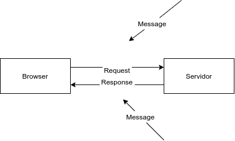

# Visualizando a comunicação



* **Message** (mensagem)

  * **Requisição** (request)

    * **Conteúdo**

      * **Method**

        * **Função**: ação que será executada no servidor, por meio dos verbos HTTP

        * **Exemplos**

          * `GET`: pegar um recurso

          * `POST`: criar um recurso

      * **Headers**

      * **Body**

    * **Exemplo**

      ```http
      GET /index.html HTTP/1.1
      User-Agent: Mozilla/4.0
      Accept: text/html
      ```

  * **Response** (response)

    * **Conteúdo**

      * **Status Code**

        * **Função**: resposta do servidor sobre o estado da requisição/resposta

        * **Exemplos**

          * `200`: OK

          * `301`: redirecionamento

          * `404`: não encontrado

          * `500`> erro interno no servidor

      * **Headers** (opcional)

      * **Body** (opcional)

    * **Exemplo**

      ```http
      HTTP/1.1 200 OK
      Server: Express
      Content-Type: text/html

      <html>...</html>
      ```

  * **Em comum: Request e Response**

    * **Conteúdo**

        * **Headers** (opcional)

          * **Função**: campos informativos em `propriedade: valor`

          * **Exemplos**

            * `Content-Type: application/json`

            * `User-Agent: Chrome`

            * `Request URL: www.google.com`

        * **Body** (opcional)

          * **Função**: armazenar conteúdo da requisição/resposta

          * **Exemplos**

            * HTML

            * JSON

            * XML


* **Recurso**

  * Local de destino da requisição

  * O endereço do recurso é descrito por meio de uma URL

  * **Exemplos**

    * `https://google.com`

    * `http://localhost:3000/posts?q=oracle`